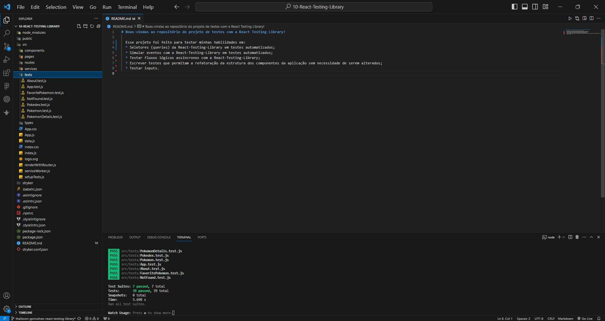

# Boas-vindas ao repositório do projeto de testes com a React Testing Library!

  Esse projeto foi feito para testar minhas habilidades em:
  * Seletores (queries) da React-Testing-Library em testes automatizados;
  * Simular eventos com a React-Testing-Library em testes automatizados;
  * Testar fluxos lógicos assíncronos com a React-Testing-Library;
  * Escrever testes que permitam a refatoração da estrutura dos componentes da aplicação sem necessidade de serem alterados;
  * Testar inputs.

